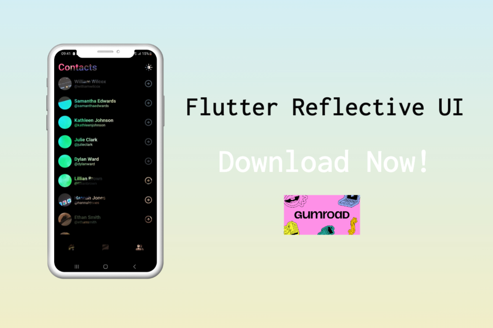

# Flutter Reflective UI

Reflective UI implementation using Flutter

## 🔖 JOIN FLUTTER COURSE (BANGLA) 🔖

_Build real, responsive applications! Learn Basic Dart Programming & start build your own application.
This course is designed for beginner to intermediate developers who want to build their future with Flutter_

[Checkout Course Now](https://www.youtube.com/playlist?list=PLDitZ-MAvK-4Bt4wRTEidukT4OxRhRTBK)

**Support Me**

- Buy this project on Gumroad [here](https://alaminkarno.gumroad.com/l/flutter-reflective-ui)
- Support me via buy me a coffee. [here](https://www.buymeacoffee.com/alaminkarno)

**⚠️ Instruction**

- For the very first, run `flutter pub get` on your favorite IDE

**Packages we are using:**

- camera: [get package](https://pub.dev/packages/camera)

**Code Credit**

- Code using Flutter with ❤️ by [Md. Al-Amin](https://github.com/alamin-karno)

## GIF:

|                         Home Screen (GIF)                          | 
|:------------------------------------------------------------------:|    
|       | 

### Repository Owner Info

### Md. Al-Amin
##### Junior Software Engineer (Android & iOS) at Rokomari.com

__Email :__ [ alamin.karno@outlook.com ](mailto:alamin.karno@outlook.com) \
__Github :__ [Md. Al-Amin](https://github.com/alamin-karno) \
__Facebook :__ [মোঃ আল-আমিন খন্দকার কর্ণ](https://facebook.com/alamin.kanro) \
__Linkedin :__ [Md. Al-Amin](https://www.linkedin.com/in/alaminkarno/)

